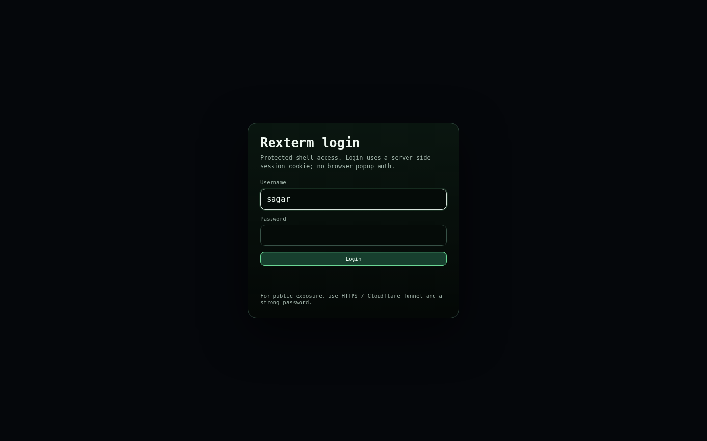
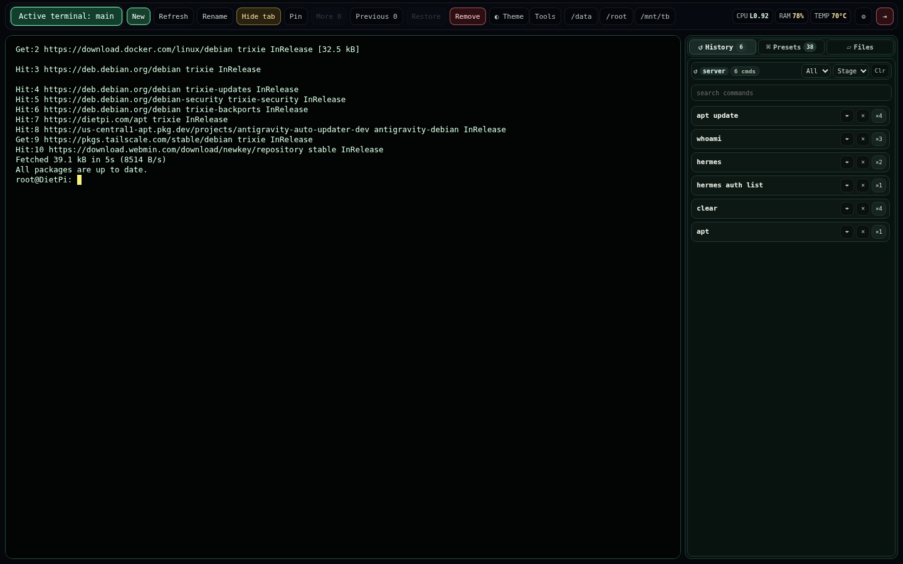
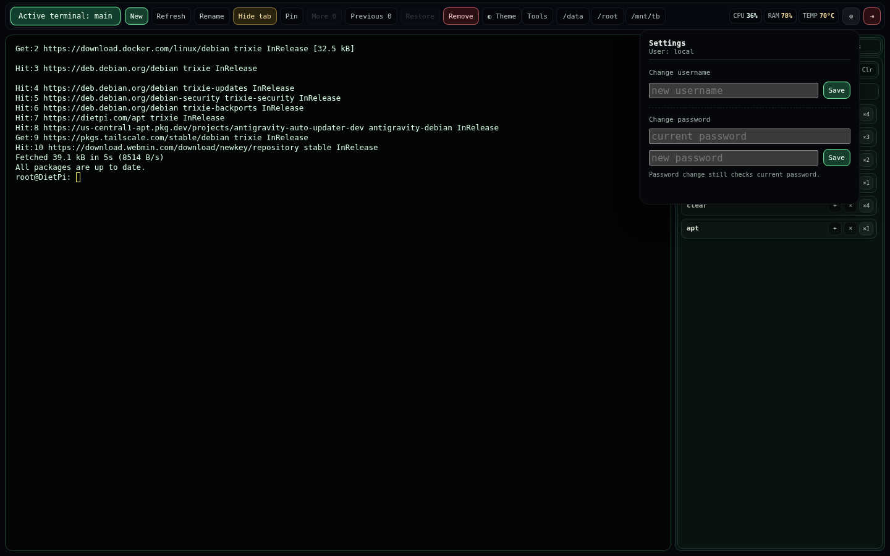

# Rexterm

[](https://github.com/SeaXen/rexterm/releases)
[](LICENSE)
[](https://www.python.org/)
[](https://www.docker.com/)

Rexterm is a standalone browser terminal focused on a simple rule:

- **host mode** = real host shell, real host commands
- **Docker mode** = isolated container shell

It is intentionally separate from Hermes dashboard, but it keeps a similar terminal-first UX:

- multi-session tabs
- split panes
- tmux-backed persistent sessions
- WebSocket streaming with HTTP polling fallback
- shared command history
- right-rail history / presets / files
- login page with in-app settings + logout controls

## Status

This repository contains the **current stdlib Python server implementation**.

Current runtime entrypoint:
- `app/server.py`

Static UI:
- `static/index.html`
- `static/vendor/xterm/`

Legacy experiments and old frontend work were moved out of the active runtime path and are not part of the shipped app.

## Features

- single-binary-style Python stdlib backend
- no nginx sidecar
- no Node/NPM build required for the active UI
- browser login page, not browser basic-auth popup
- in-app Settings dropdown for username/password management
- icon-only Settings and Logout controls in the terminal header
- tmux-backed sessions that survive browser reloads
- explicit local tab hide/remove vs backend session kill
- vendored `tmux` fallback for host environments without system tmux

## Screenshots

### Login



### Terminal workspace



### Settings dropdown



## Repository layout

```text
Rexterm/
├── app/
│   └── server.py
├── static/
│   ├── index.html
│   └── vendor/xterm/
├── scripts/
│   ├── run-host.sh
│   ├── install-host-systemd.sh
│   ├── set-auth.sh
│   └── reset-auth.sh
├── vendor-rootfs-tmux/
├── Dockerfile
├── docker-compose.yml
├── .env.example
├── .gitignore
└── README.md
```

Ignored runtime/state paths:
- `.env`
- `data/`
- `_archive/`
- caches / backup artifacts

## Requirements

### Host mode
- Linux
- `python3`
- `/bin/bash`
- `tmux`
  - either installed on host
  - or use the vendored fallback in `vendor-rootfs-tmux/`

### Docker mode
- Docker
- Docker Compose plugin (`docker compose`)

## Quick start

### What is created automatically?

On a fresh install:
- `data/` and its runtime subdirectories are created automatically by the server/scripts
- tmux/session/auth runtime JSON files are created as needed
- `.env` is **not** auto-created

So:
- you can start Rexterm without `.env` because sane defaults exist
- but for real use, `cp .env.example .env` is still recommended so you can set auth, token, and port explicitly

### Host mode (recommended for real machine access)

```bash
cd /mnt/tb/1Apps/Rexterm
cp .env.example .env
./scripts/run-host.sh
```

Ubuntu one-liner:

```bash
sudo apt update && sudo apt install -y git python3 tmux && git clone https://github.com/SeaXen/rexterm.git && cd rexterm && cp .env.example .env && ./scripts/run-host.sh
```

Debian one-liner:

```bash
sudo apt update && sudo apt install -y git python3 tmux && git clone https://github.com/SeaXen/rexterm.git && cd rexterm && cp .env.example .env && ./scripts/run-host.sh
```

DietPi one-liner:

```bash
sudo apt update && sudo apt install -y git python3 tmux && git clone https://github.com/SeaXen/rexterm.git && cd rexterm && cp .env.example .env && ./scripts/run-host.sh
```

Open:

```text
http://127.0.0.1:2344/
```

### Docker mode

```bash
cd /mnt/tb/1Apps/Rexterm
cp .env.example .env
docker compose up -d --build --remove-orphans
```

Docker one-liner:

```bash
sudo apt update && sudo apt install -y git docker.io docker-compose-plugin && sudo systemctl enable --now docker && git clone https://github.com/SeaXen/rexterm.git && cd rexterm && cp .env.example .env && sudo docker compose up -d --build --remove-orphans
```

Open:

```text
http://127.0.0.1:2344/
```

## Installation modes

### 1) Host mode

Use this when you want Rexterm to behave like a **real universal terminal**.

Commands run against the actual host environment, so tools available on the machine are available in the terminal.

What `run-host.sh` does:
- loads `.env` if present
- maps host-mode port to `REXTERM_HOST_PORT` / `REXTERM_PORT`
- sets `REXTERM_DATA_DIR` to local `./data` by default
- uses system `tmux` if present
- falls back to vendored `vendor-rootfs-tmux/` if system `tmux` is missing

Install as systemd service:

```bash
cd /mnt/tb/1Apps/Rexterm
sudo ./scripts/install-host-systemd.sh
```

Useful service commands:

```bash
systemctl status rexterm-host --no-pager
systemctl restart rexterm-host
systemctl stop rexterm-host
journalctl -u rexterm-host -n 100 --no-pager
```

### 2) Docker mode

Use this when you want isolation.

Important limitation:
- Docker mode is **not** a universal host terminal
- it only sees commands/tools/files exposed inside the container or mounted into it

Useful commands:

```bash
docker compose ps
docker compose logs -f rexterm
docker compose restart rexterm
docker compose down
```

## Configuration

Copy the template first:

```bash
cp .env.example .env
```

### Environment variables

| Variable | Purpose | Default |
|---|---|---|
| `REXTERM_PORT` | public Docker port mapping | `2344` |
| `REXTERM_HOST_PORT` | host-mode listen port | `2344` |
| `REXTERM_BACKEND_PORT` | container/internal backend port | `8080` |
| `REXTERM_SHARED_TOKEN` | token for API-style access paths | `change-me` |
| `REXTERM_AUTH_REQUIRED` | enable login requirement | `1` |
| `REXTERM_AUTH_USERNAME` | bootstrap username fallback | `admin` |
| `REXTERM_AUTH_PASSWORD_SHA256` | preferred password hash | empty |
| `REXTERM_AUTH_PASSWORD` | raw password fallback | empty |
| `REXTERM_AUTH_SESSION_TTL` | auth session lifetime in seconds | `604800` |
| `REXTERM_HISTORY_LIMIT` | stored shared history length | `300` |

## Authentication

Rexterm uses a real login page and server-side session cookies.

### First-time setup
If no account is configured, the login page switches into first-account creation mode.

### Normal use
After login:
- use the **Settings** icon in the terminal header
- change **username** from a single inline field
- change **password** with current password verification
- use the **Logout** icon to return to the login page

### Recommended password setup
Generate a SHA256 password hash:

```bash
python3 - <<'PY'
import hashlib, getpass
print(hashlib.sha256(getpass.getpass('Password: ').encode()).hexdigest())
PY
```

Put the result into `.env` as:

```env
REXTERM_AUTH_PASSWORD_SHA256=<hash>
```

### Helper scripts
Set/update auth:

```bash
./scripts/set-auth.sh
```

Reset auth:

```bash
./scripts/reset-auth.sh
```

### Stored auth state
Runtime auth files live under `data/` and are intentionally ignored by git.

Examples:
- `data/auth_account.json`
- `data/auth_sessions.json`

## Data and persistence

Persistent state lives under `data/`.

Examples:
- `data/terminal_history.json`
- `data/terminal_preferences.json`
- `data/sessions/*.json`
- `data/tmux/`

Session model:
- browser reload does **not** kill tmux sessions
- local tab hide/remove is separate from backend session kill
- deleting runtime state or tmux socket data will reset session continuity

## Vendored tmux fallback

This repository includes a vendored tmux runtime under:

```text
vendor-rootfs-tmux/
```

Why it exists:
- some host systems do not have `tmux`
- Rexterm depends on tmux-backed session persistence
- host mode should still run without forcing a system package install first

Current backend behavior:
- prefers system `tmux` if available
- otherwise auto-detects vendored `tmux`
- automatically injects the vendored library path when needed

## Versioning

- current version: `v0.1.0`
- changelog: [`CHANGELOG.md`](CHANGELOG.md)
- license: [`MIT`](LICENSE)
- releases: [GitHub Releases](https://github.com/SeaXen/rexterm/releases)

## Development

Run locally in host mode:

```bash
cd /mnt/tb/1Apps/Rexterm
./scripts/run-host.sh
```

Active server file:

```text
app/server.py
```

There is no separate frontend build step for the active app.

## Troubleshooting

### Terminal page opens but no session works
Check that tmux is usable:

```bash
command -v tmux || echo 'tmux missing'
```

If missing, Rexterm should fall back to `vendor-rootfs-tmux/` automatically.

### Port already in use
Check port `2344`:

```bash
ss -ltnp | grep ':2344'
```

Then stop the conflicting process or run on another port.

### Docker mode starts but cannot access host commands
That is expected. Use **host mode** for real host access.

### Login works but settings changes fail
- username change only needs the new username field
- password change still requires the current password
- runtime auth state is stored under `data/`

## Security notes

- do not commit `.env`
- do not commit `data/`
- prefer `REXTERM_AUTH_PASSWORD_SHA256` over raw passwords
- rotate `REXTERM_SHARED_TOKEN` before exposing beyond local/LAN use
- Docker mode mounts sensitive host paths only when you explicitly allow them via compose

## Git hygiene

This repo ignores:
- runtime state
- archives
- local secrets
- caches
- editor temp files
- backup artifacts

If you need historical experiments, keep them under `_archive/` instead of mixing them into the active runtime tree.

## License

This project is licensed under the [MIT License](LICENSE).
